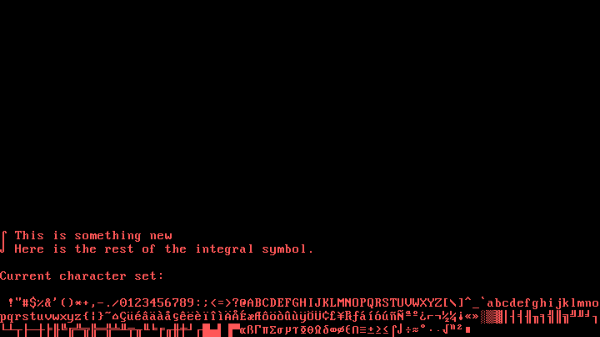

# 🩹 pwos 

   

p(atch)w(ork)os is a minimal toy operating system written in Rust. Built for fun, learning, and breaking stuff on purpose.

## Features

* Boots on x86\_64 (bare metal or QEMU)
* Written in pure Rust (`no_std`)
* Just enough to say "it works"

## How does it look?

As you can see, not much is happening.

## Dependencies

- [`bootimage=0.10.3`](https://crates.io/crates/bootimage) in the `$PATH`

## Usage

- **Build with:** `cargo build`
- **Run with:** `cargo run`
